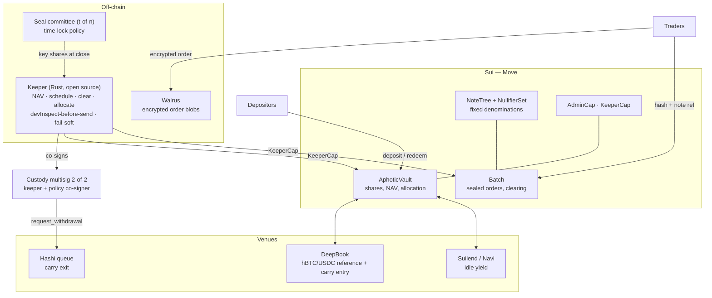

# Aphotic

**Confidential batch clearing and redemption carry for native Bitcoin on Sui.**

> *The aphotic zone is the layer of ocean below roughly 200 metres, where less than one percent of surface light penetrates. Order flow behaves the same way: visible at the surface, invisible below.*

---

## How to use this document

This README is written to be loaded as working context by a coding agent. It is a specification, not marketing. Four conventions:

| Marker | Meaning |
|---|---|
| ✅ | **Verified** by reading the Hashi source at `github.com/MystenLabs/hashi` (clone, July 2026). Treat as ground truth. |
| 📄 | **From Hashi design docs** (`design/docs/*.mdx`). Reliable but may drift from code. |
| ❓ | **Unverified.** Must be checked before being relied on. Do not build on these without confirming. |
| ⛔ | **Rejected design.** Do not propose or implement. Rationale given. |

**Rules for the agent.** Do not relitigate decisions in §3 — they are settled and the rationale is recorded. Do not silently resolve items in §12 — ask. Do not weaken any invariant in §10 to make a test pass. When a `❓` item blocks progress, verify it against the live chain or source rather than assuming.

**Naming rule.** Do not name σ-Labs, Sigma Labs, Ellen Capital, Lagoon, or rcETH anywhere in this project — not in code, comments, commit messages, documentation, tests, the front-end, or any external material. Where an operational pattern needs describing, describe the pattern generically ("the common two-scope keeper pattern", "a single-chain vault") rather than naming a protocol or firm. This applies to generated content as well as hand-written content.

---

## 1 What Aphotic is

Aphotic is two things sharing one balance sheet:

1. **A redemption-carry vault.** Buys `hBTC` at a discount on the secondary market, redeems it one-for-one through the Hashi withdrawal queue, captures the spread. Idle capital earns lending yield between carries.
2. **A sealed-order batch auction.** Clears `hBTC` at a uniform price twice daily, with orders encrypted until the batch closes. Opposing orders cross directly and never touch the queue.

The vault ships first. It does not depend on two-sided flow, so it works from the first dollar. The auction is the differentiator but needs a market; it follows.

### Why the spread exists

Hashi mints `hBTC` against a committee-managed pool of Bitcoin UTXOs. Redemption goes through an on-chain queue, rate-limited by the Guardian's token-bucket limiter 📄, batched into Bitcoin transactions roughly every 10 minutes or every N requests 📄, and paused entirely during Hashi reconfiguration, which follows every Sui epoch boundary 📄.

Exit latency is therefore variable and partly predictable. The discount at which `hBTC` trades against BTC is the market price of that latency. The carry harvests it. The auction lets participants avoid paying it to anyone.

### Why the auction exists

The queue is a public Move object. Every pending request exposes who, how much, where to, and since when ✅ (§4.2). A desk unwinding a position is watched forming in real time. Aphotic clears flow before it reaches the queue.

---

## 2 Hard constraints

Violating any of these breaks the product. They are not preferences.

1. **No custody of user funds outside Move.** The one unavoidable exception is documented in §6.3 and is gated by multisig, not by trust.
2. **The keeper holds no discretion.** It triggers deterministic computation. Every keeper-callable function must be safe to call by anyone at the scheduled time.
3. **No order content is readable before batch close.** Not by the operator, not by the keeper, not by any single Seal key server.
4. **Escrow must not leak order size.** Fixed denominations only. A free-form `Balance<BTC>` in an order object defeats the entire design.
5. **Clearing is deterministic and reproducible.** Same order set, same price, always. Anyone must be able to recompute and verify.
6. **Settlement is atomic and value-preserving.** Debits equal credits or the transaction reverts.
7. **Timing is mechanical.** Fixed public cadence. An operator must never be able to choose when a batch closes.

---

## 3 Rejected designs

Do not propose these. Each was considered and eliminated for a stated reason.

⛔ **A shared `AphoticVault` object that holds Hashi queue positions.**
`create_withdrawal` sets `sender: ctx.sender()` ✅, which on Sui is the *transaction signer*, not the calling module. A shared object can never be the `sender`. `cancel_withdrawal` asserts `request_sender() == ctx.sender()` ✅. The destination `bitcoin_address` is fixed at request time ✅ and the escrowed `Balance<BTC>` is burned on commit 📄, leaving no on-chain claim. Any such design is custodial by construction. See §6.3 for the mitigation.

⛔ **Buying or transferring a user's place in the queue.**
`WithdrawalRequest` lives inside an `ObjectBag` on `WithdrawalRequestQueue` ✅, not in the user's account. It is not a transferable object. Positions cannot be traded.

⛔ **Nautilus/TEE in v1.**
Uniform-price clearing on a fixed order set is a pure function, so it can run on-chain in Move and be verified by anyone. A TEE buys only one thing: hiding *unfilled* orders after close. That is a problem of success, not of launch. The upgrade path is a one-line policy swap (§7.4) and requires no contract changes.

⛔ **Commit–reveal for order confidentiality.**
Requires participants to be online to reveal, which creates grief-by-non-revelation and forces an anti-abandonment bond. Seal's time-lock policy supplies the same confidentiality with guaranteed reveal.

⛔ **A management fee on AUM.**
The strategy is idle most of the time by design. Charge on matched volume and realised carry (§8).

⛔ **A protocol token.**
Hashi has publicly committed to having no `$HASHI` token 📄. Emitting one in its orbit is a bad signal, and the yield must be real regardless.

⛔ **Competing on speed for plain liquidity.**
`hBTC` holders who want cash borrow on Suilend, Navi, Scallop or Fluid — all Hashi partners ❓. Holders who want to cut exposure short a perp on Bluefin ❓. Both are instant and touch no queue. Aphotic competes on confidentiality and on the carry, not on speed.

---

## 4 Verified Hashi integration surface

Everything here was read from source. Aphotic requires **zero changes to Hashi** and no permission from anyone.

### 4.1 hBTC is a plain coin ✅

`packages/hashi/sources/btc/btc.move`:

```move
public struct BTC has key { id: sui::object::UID }

// registered via sui::coin_registry::new_currency<BTC>
// DECIMALS = 8, SYMBOL = "hBTC", NAME = "BTC"
```

**No `DenyCap`, no deny list, no freeze capability anywhere in the package** ✅. Aphotic balances cannot be frozen. Note the registration path is `sui::coin_registry`, the newer standard — verify tooling compatibility ❓.

### 4.2 The withdrawal request struct ✅

`packages/hashi/sources/btc/withdrawal_queue.move:66`:

```move
public struct WithdrawalRequest has key, store {
    id: UID,
    sender: address,
    btc_amount: u64,
    bitcoin_address: vector<u8>,
    created_timestamp_ms: u64,
    status: WithdrawalStatus,
    approval_cert: Option<CommitteeSignature>,
    approved_timestamp_ms: Option<u64>,
    withdrawal_txn_id: Option<address>,
    sui_tx_digest: vector<u8>,
    btc: Balance<BTC>,
}

public struct WithdrawalRequestQueue has store {
    requests: ObjectBag,        // active: Requested, Approved
    processed: ObjectBag,       // Processing, Signed, Confirmed
    withdrawal_txns: ObjectBag,
    confirmed_txns: ObjectBag,
}
```

Every field is publicly readable. This is the leak Aphotic exists to route around.

### 4.3 Entry points Aphotic calls ✅

`packages/hashi/sources/btc/withdraw.move:364`:

```move
public fun request_withdrawal(
    hashi: &mut Hashi,
    clock: &Clock,
    btc: Balance<BTC>,           // Balance, not Coin — composes in PTBs without a wrapper
    bitcoin_address: vector<u8>, // 20 bytes (P2WPKH) or 32 bytes (P2TR), asserted
    ctx: &mut TxContext,
)
```

Asserts version enabled, unpaused, `btc.value() >= config.bitcoin_withdrawal_minimum()`, and address length ∈ {20, 32} ✅.

`withdraw.move:403`:

```move
public fun cancel_withdrawal(
    hashi: &mut Hashi,
    request_id: address,
    clock: &Clock,
    ctx: &mut TxContext,
): Balance<BTC>
```

Asserts not already processing, `request_sender() == ctx.sender()`, and `now >= created_timestamp_ms + withdrawal_cancellation_cooldown_ms` ✅.

### 4.4 Read surface for pricing and NAV

| Source | Path | Use |
|---|---|---|
| `BitcoinState` ✅ | dynamic field on `Hashi`, key `BitcoinStateKey{}` | root of all reads |
| `WithdrawalRequestQueue.requests` ✅ | `BitcoinState.withdrawal_queue` | live queue depth and age distribution |
| `.withdrawal_txns` / `.confirmed_txns` ✅ | same | batch history → latency model calibration |
| `UtxoPool.utxos` ✅ | `BitcoinState.utxo_pool` | reserves and fragmentation → next-batch cost |
| `Treasury` ✅ | `hashi::treasury` | `hBTC` supply → coverage ratio |
| `user_requests: Table<address, Bag>` ✅ | `BitcoinState` | our own requests, indexed by custody address |
| `CommitteeSet.pending_epoch_change` 📄 | `hashi::committee_set` | reconfiguration → predictable pause |
| `WithdrawalSigned` event 📄 | — | reconstruct the Guardian token bucket client-side; the node-local limiter is a deterministic projection of the on-chain stream 📄 |

### 4.5 Config defaults 📄

| Key | Default | Note |
|---|---|---|
| `bitcoin_withdrawal_minimum` | 30 000 sats | floor 547 |
| `bitcoin_deposit_minimum` | 30 000 sats | floor 546 (dust) |
| `bitcoin_confirmation_threshold` | 6 blocks | |
| `bitcoin_deposit_time_delay_ms` | 600 000 (10 min) | approve → confirm window |
| `withdrawal_cancellation_cooldown_ms` | 3 600 000 (1 h) | before a request may be cancelled |
| `paused` | false | |
| `governance_emergency_pause_threshold_bps` | 500 (5 %) | asymmetric: cheap to pause |
| `governance_emergency_unpause_threshold_bps` | 6667 (⅔) | expensive to resume |

`worst_case_network_fee = bitcoin_withdrawal_minimum − 546` = 29 454 sats at defaults 📄. Certificate threshold is 6667 bps ✅ (`hashi::threshold::CERTIFICATE_THRESHOLD_BPS`).

### 4.6 Facts that matter for modelling

- **Coin selection has no age criterion** ✅. `crates/hashi/src/utxo_pool/mod.rs:661` selects inputs largest-first, then consolidates smallest-first. Nothing rotates mid-sized UTXOs.
- **Committee weight mirrors Sui consensus voting power** ✅. `committee_set.move:394` calls `sui_system.active_validator_voting_powers()`. Total voting power is 10 000, quorum 6 667, per-validator cap 1 000 ❓ — so a certificate needs at least 7 validators.
- **Fee bumping is CPFP, not RBF** 📄. Stuck batches are bumped by spending the change UTXO or a recipient output.
- **Withdrawals pause during reconfiguration** 📄, triggered at each Sui epoch boundary (24 h).
- **`crates/hashi/src/utxo_pool/sim.rs`** ✅ is a 1 442-line pool simulator in the Hashi repo. Use it to calibrate the latency model without waiting for mainnet data.

---

## 5 Architecture



### Repository layout

```
aphotic/
├── sources/
│   ├── vault.move          AphoticVault, shares, NAV lifecycle
│   ├── notes.move          Note, NoteTree, NullifierSet, denominations
│   ├── batch.move          Batch window, SealedOrder, state machine
│   ├── clearing.move       Uniform-price match, settlement, FillProof
│   ├── balance.move        Persistent per-participant internal balance
│   ├── carry.move          Entry via DeepBook, exit via Hashi queue
│   ├── allocate.move       Pinned lending-adapter allowlist
│   ├── caps.move           AdminCap, KeeperCap, rotation
│   ├── oracle.move         Queue depth, limiter reconstruction, latency estimate
│   └── events.move
├── tests/                  Move unit + scenario tests
├── keeper/                 Rust service
│   ├── nav/                NAV derivation from on-chain state
│   ├── schedule/           06:00 / 18:00 UTC cadence
│   ├── seal/               key retrieval, decryption
│   ├── clearing/           local clearing, must match Move exactly
│   └── sim/                order-flow simulation, latency calibration
├── sdk/                    TypeScript client
├── app/                    Front-end
└── design/
    └── governance.md       operations note
```

---

## 6 Governance and permissions

Two layers: a human multisig layer and a capability-scoping layer, so automation never has open-ended access.

### 6.1 Capabilities

| Cap | Holder | May call |
|---|---|---|
| `AdminCap` | admin multisig | `approve_nav`, `set_fees`, `set_denominations`, `set_cadence`, `rotate_keeper_cap`, `pause` / `unpause`, `set_adapter_allowlist` |
| `KeeperCap` | keeper address | `propose_nav`, `close_batch`, `settle_batch`, `allocate`, `deallocate`, `place_carry_bid` |
| `VaultCap` | held by the vault object itself | internal note custody and settlement |

The keeper cannot transfer assets to an arbitrary address, rotate its own capability, mint or burn outside settlement, or change any parameter.

Admin ownership transfer is two-step: the incoming admin must accept. Pause thresholds are asymmetric, mirroring Hashi's own convention 📄.

### 6.2 NAV: two parties, not two scopes

```
propose_nav(nav)   ← keeper, via KeeperCap.  Records only.
approve_nav(nav)   ← admin multisig, via AdminCap.  Commits, mints/burns pending.
```

The common pattern in production vaults is to separate *scopes* — one automation key holds permissions on both a valuation module and a settlement module, so a compromised key performs both legs. Aphotic separates *parties*. This is affordable because valuation is twice daily and approval is a signature, not a continuous duty.

### 6.3 The one boundary Move cannot enforce

Because `create_withdrawal` sets `sender: ctx.sender()` ✅, the carry exit needs a real transaction signer, and the returning BTC lands at a Bitcoin address no Move code controls.

Mitigation, mirroring Hashi's own Guardian:

- Custody address is a **Sui 2-of-2 multisig**: keeper plus an independent policy co-signer.
- The co-signer signs `request_withdrawal` only when `bitcoin_address` equals the pinned vault address, and only within a rate limit.
- The pinned Bitcoin address is published, so redemptions are auditable on Bitcoin.

Enforced at signing, not by Move. State this plainly in all external material. It is the same trust shape the venue already asks users to accept.

---

## 7 Core mechanisms

### 7.1 Notes

Escrow uses fixed denominations, not free-form balances, because a `Balance<BTC>` carries a publicly readable amount and would leak order size regardless of encryption.

```move
public struct Note has key, store {
    id: UID,
    denom_index: u8,   // index into the governed ladder
}
```

Ladder: `0.01 / 0.1 / 1 / 10 hBTC`. Few tiers, widely spaced.

> Denominations create **uniformity**, not privacy. Privacy comes from the crowd. A ladder fine enough to express exact amounts fragments participants into singleton anonymity sets and is worse than no ladder at all.

**Commitment / nullifier.** Deposits append `C = H(denom, secret, r)` to a Merkle tree. Spends publish `N = H(secret, leaf_index)` plus a membership proof, without revealing which leaf. A nullifier set prevents double-spend and reveals nothing about origin.

v1 checks membership in Move against a stored root, with the proof supplied by the client. The ZK tier (§11, Phase 4) replaces the membership check with a Groth16 verification via `sui::groth16` ❓ — same tree, same nullifier format, different verifier.

**Timing.** Denominations still leak timing if escrow is funded at order time. Participants hold a **persistent internal balance**, topped up independently of trading; orders draw on it with no on-chain movement at submission.

### 7.2 The batch

```
OPEN ──close_batch()──▶ SEALED ──keys released──▶ CLEARING ──settle_batch()──▶ SETTLED
```

1. **Submit.** Order encrypted client-side with Seal under a **time-lock policy** keyed to the close timestamp. On-chain: a ciphertext hash and a reference to the internal balance. No amount, no side, no price.
2. **Close.** At the scheduled time only. `close_batch` reverts if called early.
3. **Decrypt.** Seal committee releases key shares. Threshold `t`-of-`n`, committee composed **without Enoki** (§7.5).
4. **Clear.** Uniform-price match, executed **on-chain in Move**, deterministic.
5. **Claim.** Participants claim fills against the published Merkle root.

Uniform-price clearing does not make front-running hard, it makes it meaningless: everyone executes at the same price at the same instant. The time-lock supplies the confidentiality that makes the batch fair.

### 7.3 Cadence

**06:00 and 18:00 UTC. Settle every pass, with or without pending orders.**

Fixed cadence does double duty. It removes discretionary timing, which would otherwise let an operator advantage selected orders — the exact attack uniform-price clearing exists to eliminate. And it acts as a Schelling point: participants converge on two moments, concentrating liquidity and thickening the anonymity set rather than diluting both across the day.

### 7.4 Confidentiality: what is and is not hidden

| | Hidden from |
|---|---|
| Size, price, side — before close | everyone, subject to the Seal threshold |
| Order contents — after close | **nobody**, including unfilled orders |
| Clearing price, aggregate volume | published by design |
| Final Hashi redemption | not hidden; the queue is public |

Two limits, stated without hedging:

1. Pre-close confidentiality is `t`-of-`n`. A colluding Seal quorum decrypts early.
2. Post-close, unfilled interest becomes visible and is exploitable in the next batch.

Both close with the same upgrade: replace the time-lock policy with a **PCR-gated policy**, so only an attested Nautilus enclave ever decrypts 📄. Order format, Seal integration and settlement contract are unchanged. Design for it; do not build it now.

### 7.5 Seal committee composition

Enoki is both a zkLogin salt provider and a Seal key server 📄. Using it for both hands one party identity linkage **and** a decryption share.

**Compose the Seal committee without Enoki.** Available alternatives 📄: Ruby Nodes, NodeInfra, Studio Mirai, Overclock, H2O Nodes, Triton One.

zkLogin itself is safe to integrate: against the market, a zkLogin address is exactly as opaque as an ed25519 one. Offer Enoki for retail onboarding and a self-managed path (`@mysten/sui/zklogin`) for desks with a harder threat model. Sponsored transactions are fine — orders are encrypted before entering the transaction, and they are the only way to let someone exit without holding SUI.

### 7.6 The carry

**Entry.** Buy `hBTC` below par on DeepBook when the discount exceeds the hurdle. Hurdle = expected latency × cost of capital + gas + a margin for latency-model error.

**Exit.** `request_withdrawal` through the custody multisig (§6.3), then hold or recycle the native BTC.

**Latency model.** Inputs: queue depth from `WithdrawalRequestQueue.requests` ✅, reconstructed limiter capacity from `WithdrawalSigned` events 📄, `pending_epoch_change` for scheduled pauses 📄, UTXO pool fragmentation for batch cost ✅. Output: a distribution over wait time, not a point estimate.

**Do not size the carry off a point estimate.** The tail is the risk.

### 7.7 NAV

| Leg | Source | |
|---|---|---|
| Idle `hBTC` | `Balance<BTC>` in vault | ✅ |
| Idle `USDC` | `Balance<USDC>` in vault | ✅ |
| Lending positions | adapter `convert_to_assets(shares)` | ❓ |
| Notes in escrow | denom × count, net of nullified | ✅ |
| Pending Hashi withdrawals | `WithdrawalRequest.btc_amount` where `sender` = custody | ✅ |
| In-flight withdrawals | `WithdrawalTransaction` referencing our request ids | ✅ |
| **Native BTC at redemption address** | **Bitcoin UTXO set — not readable by Move** | ⚠️ |

All legs at par (1 BTC = 1 hBTC); carry P&L accrues through the entry discount.

**The last leg is the honest gap.** A single-chain vault has a fully reconstructible NAV, because every input sits behind one RPC endpoint. Aphotic's carry crosses to Bitcoin, and Sui has no Bitcoin light client — Hashi itself approves deposits by committee attestation, not by SPV proof 📄.

Three mitigations, in order of strength:

1. Publish and pin the redemption address; anyone can check the balance.
2. **Cap NAV attribution to that leg at the sum of on-Sui-readable `WithdrawalRequest.btc_amount` values that produced it.** The unverifiable component can never exceed the verifiable claim behind it.
3. A Bitcoin header relay in Move — permissionless submission, cumulative-work fork choice, Merkle inclusion — closes the gap. Roadmap, not dependency.

Do not present the NAV as fully reconstructible.

---

## 8 Fees

Charged on **matched volume and realised carry**. Never on AUM. Governed by `AdminCap`, published on change.

LP shares are a fungible `Coin<APHOTIC_LP>`, not a position object — fungible shares stay composable and listable; a bespoke position object traps the liquidity.

---

## 9 Keeper

Open-source Rust. Off-chain. Not a smart contract. Holds no discretionary power.

**Required behaviours**, standard for production keeper services:

- **`devInspect`-before-send.** Simulate every transaction; catch reverts off-chain, never broadcast them.
- **Fail-soft.** Exponential backoff, no crash on transient errors, and specifically no crash across Hashi reconfiguration windows when withdrawals are paused 📄.
- **Re-derive, never cache.** Recompute the full backing each pass from on-chain state.
- **Clearing parity.** The Rust clearing implementation must produce bit-identical output to the Move one. Property-test them against each other; a divergence is a release blocker.
- **Liveness is not privileged.** If the keeper is down, anyone must be able to trigger `close_batch` and `settle_batch` at or after the scheduled time. The keeper is an optimisation, not a gatekeeper.

---

## 10 Invariants

Write these as tests first.

**Settlement**
- `settle_batch` reverts unless total debits equal total credits.
- No participant is filled outside their limit price.
- Every fill in the Merkle root corresponds to exactly one decrypted order in the batch.
- Clearing is idempotent: re-running on the same order set yields the same price and the same root.

**Notes**
- A nullifier can be consumed at most once.
- Total note value in the tree equals `Balance<BTC>` held by the vault minus deployed capital.
- No `Note` carries a free-form amount field.

**Batch**
- `close_batch` reverts before the scheduled timestamp.
- No entry function reveals order contents while state is `OPEN`.
- Batch state transitions are monotonic; no path returns to `OPEN`.

**NAV**
- `approve_nav` reverts if `|nav − last_nav| / last_nav` exceeds the governed bound.
- `approve_nav` reverts if the clearing price deviates from the DeepBook mid beyond the governed bound.
- NAV attributed to the native-BTC leg never exceeds the sum of outstanding on-Sui withdrawal claims.
- `total_supply(APHOTIC_LP) × nav ≤ vault_assets`.

**Capabilities**
- No `KeeperCap` function can move assets to an address outside the pinned allowlist.
- No `KeeperCap` function can mint, burn, or rotate a capability.
- `AdminCap` transfer requires explicit acceptance by the recipient.

**Carry**
- The carry leg reverts if it would return less `hBTC`-equivalent than it consumed.
- `request_withdrawal` is never called with a `bitcoin_address` other than the pinned one.

---

## 11 Build sequence

Ordered. Do not skip ahead; each step de-risks the next.

**Phase 0 — validation (before any Move).**
Confirm with liquidity partners that intent leakage on `hBTC` blocks is a real cost. Independently, measure the `hBTC`/BTC discount once mainnet liquidity exists. If the discount is persistently below the hurdle, the carry does not work and the auction has no anchor.

**Phase 1 — vault.**
`vault.move`, `caps.move`, `allocate.move`. Deposits, shares, NAV propose/approve, idle allocation. No carry, no auction. This alone is a shippable product and does not depend on two-sided flow.

**Phase 2 — carry.**
`carry.move`, `oracle.move`, custody multisig, latency model calibrated against `sim.rs`. Paper-trade the model before committing capital.

**Phase 3 — auction.**
`notes.move`, `batch.move`, `clearing.move`, `balance.move`, Seal integration. Uniform-price clearing on-chain.

**Phase 4 — hardening.**
Groth16 membership circuit; PCR-gated Seal policy; Bitcoin header relay for NAV closure.

For a hackathon, Phase 1 plus a mocked Phase 3 demonstrates the idea in a weekend. Do not attempt Phase 2 in that window — the multisig and the latency model are where the time goes.

---

## 12 Open questions — ask, do not assume

1. ❓ Deployed Hashi package IDs on Sui testnet, and the state of `MystenLabs/hashi-ts-sdk`.
2. ❓ Do Suilend, Navi, Scallop or Fluid have live `hBTC` markets? The lending leg assumes at least one.
3. ❓ Exact Seal Move API for time-lock policies, and confirmation that a `seal_approve` function can gate on a timestamp alone.
4. ❓ Sui per-validator voting-power cap — confirmed at 1 000 of 10 000, i.e. 10 %? This determines the minimum colluding set.
5. ❓ Gas ceiling for on-chain clearing. Sorting is `O(n log n)`; measure and fix a maximum batch size as a governed parameter rather than discovering it in production.
6. ❓ Storage-rebate economics of the denomination ladder — many small objects have a cost profile that should be measured before the ladder is fixed.
7. ❓ Does `sui::groth16` support the curve and proof format the intended circuit toolchain emits?

---

## 13 Known limitations

State these in any external material. They are not weaknesses to hide; disclosing them is what makes the rest credible.

- **Two-sided flow is the principal risk to the auction, and it is economic, not technical.** Internalisation needs natural buyers. The organic bid comes from participants entering Hashi who would rather not wait 6 confirmations plus the 10-minute mint delay 📄. That flow is real but likely thinner than exit flow. The vault does not depend on it, which is why it ships first.
- **No anonymity set at launch.** Uniform notes hide nothing among three participants. This property emerges with volume and cannot be bootstrapped cryptographically.
- **The venue may be worth little in calm markets.** If the Guardian bucket is generously sized, the queue clears in minutes and there is no spread. Aphotic is closer to congestion insurance than to a bridge. One structural point in its favour: the limiter config lives in the enclave's `InitConfig`, whose hash each key provisioner recomputes independently at provisioning 📄, so widening throughput under stress requires a fresh ceremony with a KP quorum. Congestion, once it starts, persists.
- **Aphotic inherits all of Hashi's trust assumptions.** `hBTC` is a claim on a committee-managed pool; deposits are approved by attestation without an on-chain light client 📄; and the Guardian's protection has a per-UTXO horizon, since the recovery tapleaf is MPC-only after a 60-day relative timelock 📄 while coin selection has no age criterion ✅.
- **Aphotic is not trustless.** It is no less trustworthy than the venue it serves. That is the honest bar, and the one to state.

---

## 14 Glossary

| Term | Meaning |
|---|---|
| **hBTC** | Hashi's Sui-side claim on pooled native BTC. `Coin<BTC>`, 8 decimals ✅ |
| **Carry** | Buy a claim below par, redeem at par, capture the spread |
| **Queue** | Hashi's `WithdrawalRequestQueue` — the redemption path and its latency |
| **Limiter** | Guardian's token-bucket rate limit on outflows 📄 |
| **Reconfiguration** | Hashi's per-epoch MPC key resharing; withdrawals pause 📄 |
| **Note** | Fixed-denomination escrow unit; the unit of uniformity |
| **Nullifier** | Single-use spend tag that reveals nothing about which note it spends |
| **Batch** | One clearing window: open → sealed → clearing → settled |
| **Uniform price** | One clearing price for every participant in a batch |
| **Internalisation** | Two opposing orders crossing without touching the queue |
| **Time-lock policy** | Seal access policy that becomes satisfiable at a timestamp |
| **PCR** | TEE measurement register; identifies exactly which binary runs 📄 |

---

## 15 References

- [Hashi](https://github.com/MystenLabs/hashi) — source, and design docs at [mystenlabs.github.io/hashi/design](https://mystenlabs.github.io/hashi/design)
- [Seal](https://seal.mystenlabs.com/) — threshold IBE and on-chain access policies
- [Nautilus](https://docs.sui.io/concepts/cryptography/nautilus) — deferred, see §7.4
- ERC-7540 — asynchronous request/settle semantics, adapted to Move

## License

Apache-2.0
