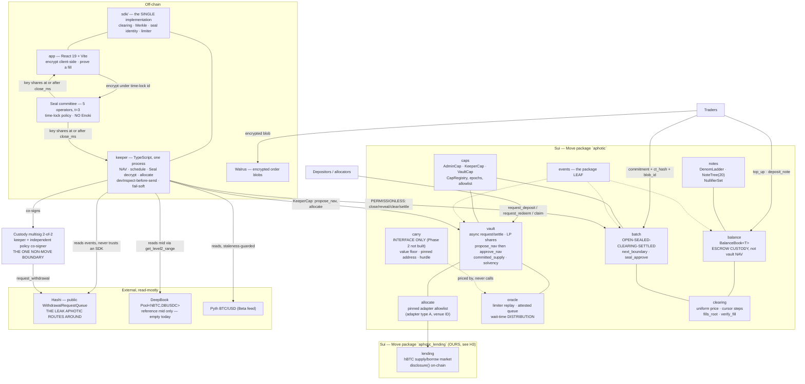
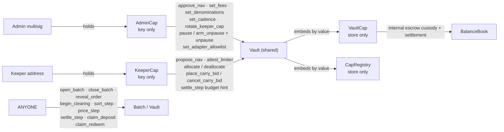
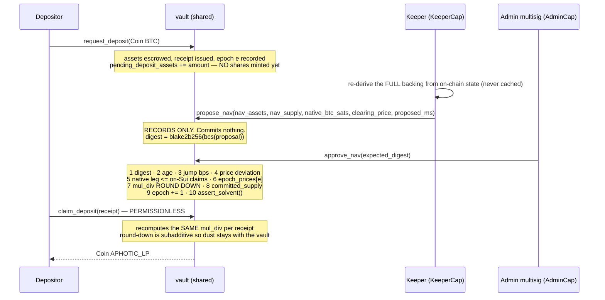
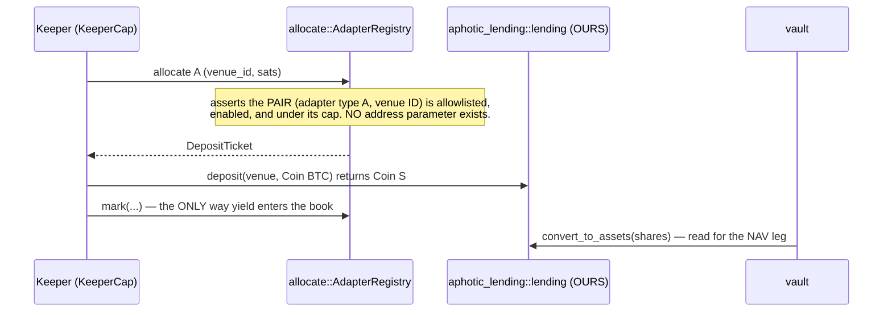
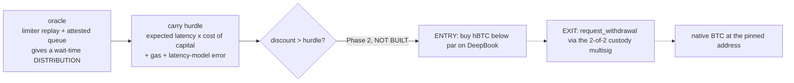

# ARCHITECTURE.md — Aphotic system model

> Purpose: the component map, the object/capability graph, the end-to-end flows, and the
> trust-boundary table. This document says **where a thing lives and who may touch it**; it does
> not restate constants (those are `docs/FACTS.md`) or module signatures (those are
> `docs/MOVE-PACKAGE.md`).
> Read after: `aphotic.md`, `docs/GOVERNANCE.md`, `docs/DESIGN-V2.md`, `docs/RECON.md`, `docs/FACTS.md`.
>
> **Rewritten 2026-07-26 for the v2 product.** The v1 architecture (a market-making vault quoting
> `hBTC/DBUSDC` maker-first on DeepBook, with a `TradeCap`-only keeper and Move-composed exits to an
> address pinned at deposit) is dead. If you find a diagram with `gateway`, `router` or `journal` in
> it, it is v1 and it is wrong.

---

## 1. The one-paragraph model

Aphotic is **two strategies sharing one balance sheet, and two Move balance sheets sharing one
product**. A **redemption-carry vault** buys `hBTC` below par, redeems it 1:1 through the Hashi
withdrawal queue and lends idle capital between carries; a **sealed-order batch auction** clears
`hBTC` at a uniform price twice daily so opposing flow crosses **before** it reaches that queue. The
vault's assets are valued in a two-party NAV cycle (keeper proposes, admin multisig approves) and
the auction's escrow is custodied **separately** so a settlement can never land between the two
halves of that cycle. Everything on the auction's critical path is permissionless; the keeper is an
optimisation, never a gatekeeper.

---

## 2. Component map



**Read the diagram for one thing above all:** there is **no arrow from the keeper to anything that
moves value to an address**. Every keeper edge lands on a function that either records a number, or
routes to a pre-pinned allowlist entry, or is permissionless anyway. That is not a convention; §5
explains how it is enforced.

---

## 3. The object and capability graph

### 3.1 Objects

| Object | Kind | Holds | Notes |
|---|---|---|---|
| `Vault` | **shared** | `Balance<BTC>` idle · `Balance<USDC>` idle · `CapRegistry` (by value) · `VaultCap` (by value) · LP `TreasuryCap` · pending counters · `epoch_prices` | the only object whose NAV is proposed and approved |
| `BalanceBook<T>` | **shared** | custodied escrow: `total_base`, `note_backed_base`, per-participant `Table<address, Account>` | **NOT part of vault NAV** — see §7 / `docs/GOVERNANCE.md` §9 D-G1 |
| `NoteTree` | **shared** | `filled_subtrees` (depth 20, in-object), a root ring | an append is 20 hashes and **zero** dynamic-field entries |
| `NullifierSet` | **shared** | `Table<vector<u8>, bool>` | **one** store entry per spend |
| `DenomLadder` | in-object | the append-only ladder | repricing a tier would revalue live notes |
| `BatchRegistry` | **shared** | `policy_version`, `cadence_ms`, `offset_ms`, `MAX_BATCH_SIZE`, `emit_per_fill` | the second argument to `seal_approve` |
| `Batch` | **shared** | `state`, `close_ms`, `orders`, `revealed`, `perm`, cursors, `fills_root` | one per window; state is monotonic |
| `AdapterRegistry` | **shared** | the pinned `(adapter type A, venue ID)` allowlist with per-venue caps | `allocate.move` imports no lending package |
| `AdminCap` | owned by the admin multisig | — | `key` only |
| `KeeperCap` | owned by the keeper address | — | `key` only |
| `VaultCap` | **inside the Vault** | — | `store` only ⇒ **can never be a top-level owned object** |

### 3.2 Capabilities — the ability choices *are* the enforcement



| Cap | Abilities | What that structurally prevents |
|---|---|---|
| `AdminCap` | `key` only — no `store` | can never be `public_transfer`d and can never be wrapped ⇒ the **two-step handover with explicit acceptance is unbypassable** |
| `KeeperCap` | `key` only | only `rotate_keeper_cap` can deliver one ⇒ the registry's `keeper` address is **always** the address that holds it |
| `VaultCap` | `store` only — no `key` | can never be a top-level owned object; it lives only inside the vault ⇒ **no address can ever hold it** |
| `CapRegistry` | `store` only | embedded by value in the Vault, not shareable ⇒ two registries can never claim the same `vault_id` |

`admin_epoch` and `keeper_epoch` are monotonically increasing; a cap minted before the last rotation
carries the old epoch and is rejected. `MAX_ALLOWLIST = 32` — the allowlist is a governance
artefact, not a routing table.

---

## 4. The flows

### 4.1 Vault — deposit request → NAV approval → claim



Redemption is the mirror: `request_redeem(shares)` → `approve_nav` prices the epoch →
`claim_redeem(receipt)` releases assets. **Neither `request_redeem` nor `claim_redeem` checks the
pause flag** — a paused vault still lets holders leave.

The two-party split is the point: **the keeper proposes and the admin approves, and neither can move
the share price alone.** The digest check exists so a keeper cannot swap the proposal in a race
after the multisig has signed the numbers.

`approve_nav` is **O(1)** — it never iterates requests, because a per-request loop against the
1 000-entry store ceiling is a liveness bug waiting to happen.

### 4.2 Auction — note deposit → submit → close → reveal → clear → settle

```mermaid
sequenceDiagram
    participant T as Trader (app, client-side)
    participant N as notes / balance
    participant W as Walrus
    participant B as batch (shared)
    participant S as Seal committee (t=3 of 5 operators)
    participant C as clearing
    participant ANY as Anyone

    T->>N: top_up(Coin BTC) and/or deposit_note(commitment)
    Note over N: escrow is FIXED-DENOMINATION notes + a persistent<br/>internal balance. NO amount field on a Note.<br/>Topping up is decoupled in time from trading.
    T->>T: build Order, commitment = blake2b256(bcs(Order))
    T->>S: encrypt under inner id = close_ms(LE) || policy_version(LE) || batch_id
    T->>W: PUT ciphertext, get blob_id
    T->>B: submit_order(commitment, ct_hash, blob_id)
    Note over B: state OPEN. No amount, no side, no price on chain.<br/>Rejected within SUBMIT_CUTOFF_MS (60s) of close.<br/>A FULL batch rejects submits and still closes on the boundary.
    ANY->>B: close_batch() — PERMISSIONLESS, reverts before close_ms
    Note over B: state SEALED. The BalanceBook snapshot FREEZES here.
    S-->>ANY: key shares become derivable (time-lock satisfiable by ANYONE)
    ANY->>B: reveal_order(order) / reveal_many(orders)
    Note over B: asserts blake2b256(bcs(order)) == the stored commitment
    ANY->>C: begin_clearing() then sort_step(budget) then price_step(budget)
    Note over C: canonical order · candidate prices · max volume<br/>tie-break |demand-supply| then lowest p<br/>INTEGER ONLY, no floats
    ANY->>C: settle_step(budget) — cursor-driven, resumable
    Note over C: PUSH, not claim. Under-funded fills TRUNCATE to<br/>min(fill, frozen balance); counterparty recomputed symmetrically.<br/>sum(debits) == sum(credits) + fee.
    C-->>B: state SETTLED, fills_root published
    T->>C: verify_fill(leaf, path) — the transparency surface
```

**Nothing on that path requires the keeper.** `KeeperCap` appears exactly once, on `settle_step`,
and only as a gas-priority hint on a function that is permissionless anyway. If the keeper is down,
anyone finishes the batch.

### 4.3 Idle allocation



`allocate.move` is a **leaf**: it imports no other `aphotic` module and no lending package, so it can
neither cycle nor pin a venue at compile time. Recall (`deallocate`) is **never** gated by pause or
by disabling an adapter — lowering a cap blocks new deployment without trapping capital.

### 4.4 The carry — designed, priced, deliberately not executed



`carry.move` ships as **interface only**: the three pure predicates that guard the leg
(value-preservation floor, pinned-address equality, carry hurdle) are real and tested, and there is
deliberately **no execution path** — nothing in the module touches DeepBook, Hashi, a `Balance<BTC>`
or any shared object. Three independent reasons, each sufficient: `aphotic.md` §11 says not to
attempt Phase 2 in this window; the `Pool<hBTC,DBUSDC>` book is empty on both sides with no
observable mid; and the exit leg cannot be composed from a shared object at all (§5.3).

**Do not size the carry off a point estimate. The tail is the risk** — which is why `oracle.move`
returns a distribution and an explicit "unbounded" sentinel for a quantile that lands in the open
tail.

---

## 5. What the keeper can and cannot do

### 5.1 The complete keeper-callable list

There are **five** entries, and nothing may be added without a written decision
(`docs/DESIGN-V2.md` §7, mirrored in `docs/FACTS.md#keeper-callable`):

| Module | Function | Why it is safe |
|---|---|---|
| `vault` | `propose_nav` | records only; commits nothing |
| `vault` | `attest_limiter` | bounded reading; cannot exceed admin-set bounds |
| `allocate` | `allocate` / `deallocate` | destination restricted to the pinned allowlist |
| `carry` | `place_carry_bid` / `cancel_carry_bid` | value-preservation floor asserted in Move (interface only today) |
| `clearing` | `settle_step` (budget hint) | permissionless anyway; the cap only prioritises gas |

### 5.2 The invariant is structural, not a runtime check

> **Every keeper-gated function takes NO `address` parameter at all.**

This is the enforcement. A permission check can be bypassed by a bug; a **missing parameter cannot
be supplied**. A keeper that is fully compromised still has no way to *name* a destination — the
only destinations that exist are the ones the `AdminCap` holder pinned in advance.
`gates.ps1 keepercap` fails the build if an `address` parameter appears on any of them, and
`caps_tests::keeper_functions_take_no_address_param` asserts the same thing from inside the suite.

⚠ **Do not trust a gate you have not seen fail.** Writing `keepercap` revealed that the older `g2`
gate — guarding this same invariant — passed a function taking `bitcoin_address: vector<u8>`,
because a word-bounded `address` match misses the underscore. Every gate must be proved against a
deliberately-violating fixture tree as well as a compliant one.

The keeper therefore **cannot**: transfer assets to an arbitrary address · rotate its own capability
· mint or burn shares outside settlement · change any parameter · choose when a batch closes · read
an order before close · call anything outside the five rows above.

### 5.3 The one boundary Move cannot enforce

`hashi::withdraw` sets `sender: ctx.sender()`, which on Sui is the **transaction signer**, never the
calling module. Consequences, all verified against source:

- a **shared object can never hold a queue position**;
- `cancel_withdrawal` asserts `request_sender() == ctx.sender()`, so only the original signer can
  cancel;
- the destination `bitcoin_address` is fixed at request time and the escrowed `Balance<BTC>` is
  burned on commit, leaving **no on-chain claim**;
- a `WithdrawalRequest` lives inside an `ObjectBag` on the queue, not in the user's account — it is
  not transferable, so **positions cannot be bought or traded**.

⇒ **The redemption leg cannot be made non-custodial in Move.** The mitigation mirrors Hashi's own
Guardian: the custody address is a **Sui 2-of-2 multisig** (keeper + an independent policy
co-signer); the co-signer signs `request_withdrawal` only when `bitcoin_address` equals the pinned
vault address and only within a rate limit; the pinned Bitcoin address is published so redemptions
are auditable on Bitcoin. **Enforced at signing, not by Move — say so plainly in all external
material.** It is the same trust shape the venue already asks users to accept.

### 5.4 Required keeper behaviours

- **`devInspect`-before-send.** Simulate every transaction; catch reverts off-chain and never
  broadcast them.
- **Fail-soft.** Exponential backoff, no crash on transient errors, and specifically **no crash
  across Hashi reconfiguration windows**, during which withdrawals are paused by the protocol at
  every Sui epoch boundary.
- **Re-derive, never cache.** Recompute the full backing each pass from on-chain state.
- **Clearing parity.** A divergence from the Move implementation is a **release blocker**.
- **Liveness is not privileged.** If the keeper is down, anyone triggers `close_batch` and the
  settlement steps at or after the scheduled time.
- **Never fall back to plaintext** if fewer than `t` Seal servers are live — refuse to open the
  batch.

---

## 6. Where the boundaries of honesty are

Four places where the architecture is weaker than a diagram makes it look. Each must be stated
wherever the corresponding number or claim appears.

| # | The gap | Where it lives |
|---|---|---|
| **H1** | **`hBTC` is custodial-threshold wrapped BTC.** Aphotic inherits every Hashi trust assumption: committee attestation instead of an on-chain light client, a Guardian enclave in a 2-of-2, and a ~60-day CSV recovery leaf that is MPC-only afterwards while coin selection has no age criterion. Validator collusion: **protocol floor 7, live testnet today 32 — always both, always labelled.** | the whole product |
| **H2** | **v1 note spends are LINKABLE.** The Merkle path is supplied in the clear, so `path_index` names the leaf. **v1 delivers uniformity, not unlinkability.** The commitment/nullifier machinery earns its keep by making Phase 4 a verifier swap — not by hiding anything today. | `notes.move`, the app's limitations panel |
| **H3** | **The hBTC lending counterparty is ours.** No hBTC lending market exists on Sui testnet, so we deployed one (`lending/`). A yield figure from it is a figure from ourselves. It is uncollateralised and has no liquidations, both on purpose and both returned by `disclosure()` on-chain so a front-end cannot render the APY without them. | `allocate.move` → `aphotic_lending::lending` |
| **H4** | **One NAV leg is not Sui-verifiable.** Native BTC at the redemption address lives in the Bitcoin UTXO set, and Sui has no Bitcoin light client. Mitigations, in order of strength: publish and pin the address; **cap the leg at the sum of on-Sui-readable `WithdrawalRequest.btc_amount` values that produced it** (asserted in `approve_nav`); a Move header relay as roadmap, not dependency. **Never present the NAV as fully reconstructible.** | `vault::approve_nav` step 5 |

Plus the one confidentiality limit that is a property of the design rather than a gap:
**after close, nothing is hidden — including unfilled orders**, which become visible and are
exploitable in the next batch. Both that and the `t`-of-`n` pre-close limit close with the same
upgrade: replace the time-lock policy with a **PCR-gated policy** so only an attested Nautilus
enclave ever decrypts. Order format, Seal integration and settlement contract are unchanged, which
is exactly why it is deferred rather than designed around.

---

## 7. Trust boundaries

| # | Boundary | Enforced by | What a total compromise of the left side buys |
|---|---|---|---|
| T1 | Depositor → `vault` | Move | nothing beyond that depositor's own shares. Requests are escrowed and priced at an approved epoch price. |
| T2 | Keeper → `vault` / `allocate` | **Move, structurally**: no `address` parameter on any keeper-gated function; `KeeperCap` is `key`-only and epoch-bound | a proposed NAV the admin has not approved, and routing to an already-pinned venue up to its cap. **No value movement to any address of the attacker's choosing.** |
| T3 | Keeper → `batch` / `clearing` | **nothing — deliberately.** These are permissionless | nothing. The schedule and the commitments are the authorization. A malicious keeper can only do what any member of the public can do. |
| T4 | Admin multisig → `vault` | Move + the off-chain multisig policy | parameter changes and NAV approval. It **cannot** propose a NAV (`admin_cannot_propose_nav`) and cannot reach the LP treasury outside settlement. Pause is cheap; unpause needs `arm_unpause` in an earlier transaction plus a delay. |
| T5 | **Custody multisig → Hashi queue** | **signing policy, NOT Move** (§5.3) | ⚠ **this is the custodial boundary.** A 2-of-2 compromise redirects a redemption. Mitigated by the co-signer's pinned-address + rate-limit policy and by publishing the Bitcoin address. Stated plainly, never minimised. |
| T6 | Seal committee → order confidentiality | threshold cryptography, `t = 3` of 5 **operators** | a colluding quorum decrypts **before** close. Counted by operator, not by server, because two servers from one operator are one failure domain. Enoki is excluded because it is also a zkLogin salt provider. |
| T7 | Hashi committee → `hBTC` itself | Hashi's own threshold Schnorr + Guardian | the backing. **This is H1** and it is not ours to fix; it is ours to state. |
| T8 | `oracle::QueueObservation` → NAV inputs | **keeper attestation**, checked for internal consistency at construction | a lie about queue depth. Acceptable **only** because the claim is independently falsifiable off-chain against the public queue object — and it would **not** be acceptable for custody. |
| T9 | Walrus / the app → order plaintext | client-side encryption before the blob leaves the browser | nothing: blobs are public and discoverable **by design**, which is why they are encrypted before upload, always. |

---

## 8. Why `sdk/` is structural, not cosmetic

Four algorithms must be byte-identical across languages:

| Algorithm | Move | TypeScript |
|---|---|---|
| **clearing** | `clearing.move` | keeper (settle driver) + app (verifier) |
| **the Merkle tree** | `notes.move` | app (prover) + keeper (root check) |
| **the Seal inner id** | `batch.move` decoder | app encoder + keeper encoder |
| **the limiter** | `oracle.move` | `keeper/src/hashi/limiter.ts` |

`keeper/src/hashi/limiter.ts`'s banner already carries the rule — *"@forbidden a SECOND copy of this
algorithm anywhere"* — and `keeper/test/limiter.cross.test.ts` exists precisely because a duplicate
drifted once. Duplicating clearing across keeper and app would reintroduce that failure in the one
place where a divergence is a **release blocker**.

`sdk/` needs no build step: `"exports": { "./*": "./src/*.ts" }`, consumed via
`keeper/tsconfig.json` `paths` and `app/vite.config.ts` `resolve.alias`.

---

## 9. Demo boundary

| Leg | Live? | Why |
|---|---|---|
| Deposit / redeem request, NAV propose→approve, claim | **LIVE** | pure Sui, instant |
| Note deposit, order submit (encrypted), close, reveal, clear, settle, verify a fill | **LIVE** | pure Sui + Seal; the clearing **is** the demo |
| Idle allocation to the lending market | **LIVE** — with H3 said out loud | our own counterparty |
| Move ↔ TypeScript clearing parity, via `devInspect` | **LIVE** | the strongest thing to show |
| **BTC in (deposit)** | ❌ **~70+ min** | pre-stage; show an earlier confirmed signet tx |
| **BTC out (withdrawal)** | ❌ **~1.5–2 h** | pre-stage; show an earlier confirmed signet tx |
| The carry itself | ❌ **not built** | D2 / D3 / D6 — say so; do not mime it |

`docs/DEMO.md` carries the minute-by-minute script and the fallback.
