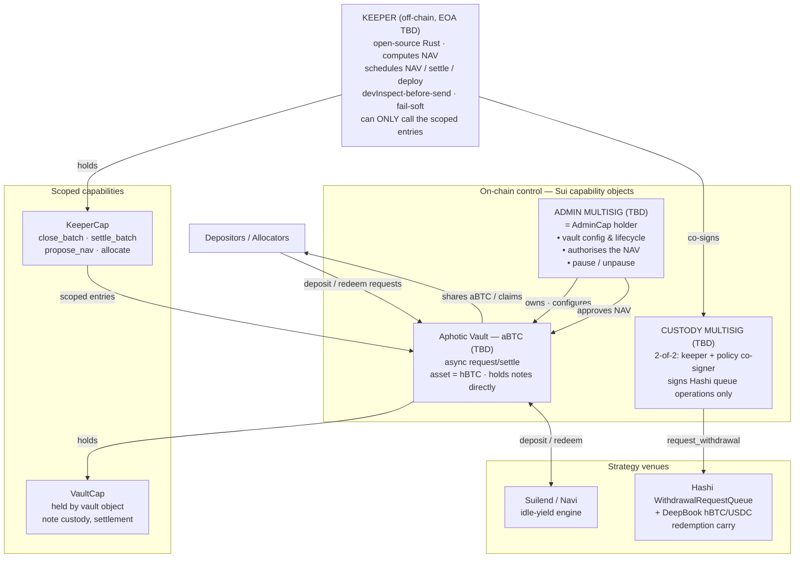

# Governance & Operations of the Aphotic "hBTC Redemption Carry" Vault

**Aphotic Research** — *draft, July 2026*

> **Status.** This is a design specification, not a description of a live system. Hashi has been on testnet since 22 July 2026 with no announced mainnet date; Aphotic targets that window. Addresses are marked `TBD` until deployment. The structure follows the conventions of published vault governance and operations notes.
>
> **Provenance (2026-07-26).** This file was `git mv`'d from the repository root
> (`aphotic-governance.md`) to `docs/GOVERNANCE.md` per `docs/DESIGN-V2.md` §12. The body below is
> **unchanged**. Where the build knowingly departs from it, the departure is recorded in
> **§9 Deviations of record** at the end of this file — never as a silent edit to the body.
> Read after: `aphotic.md`. Read alongside: `docs/DESIGN-V2.md`.

---

## Abstract

The Aphotic "hBTC Redemption Carry" vault (`aBTC`, `TBD`) is an asynchronous request/settle vault denominated in `hBTC`, the Bitcoin-backed asset minted by [Hashi](https://github.com/MystenLabs/hashi) on Sui. This note describes how it is governed and operated. The design is non-custodial on the Sui side: all vault capital is held in Move objects governed by scoped capability objects, while an off-chain keeper automates valuation, settlement and strategy execution without ever holding discretionary power over funds. We cover the strategy, the curators, vault administration, the permission model and its safeguards, the NAV computation mechanism, and the confidential clearing layer. Every role and every position backing the vault is independently verifiable on-chain, with one documented exception (§5.4). One custody boundary is enforced by a Sui multisig rather than by Move, for a structural reason set out in §4.3.

---

## Figure 1 — Governance & operations stack



*An off-chain keeper drives the vault only through scoped on-chain capability objects; it holds no discretionary power. The single exception is the Hashi queue leg, which requires a transaction signer and is therefore gated by a 2-of-2 multisig rather than by Move.*

---

## 1 Overview

### What the vault does

The vault runs two complementary strategies on a single `hBTC` balance.

Most of the time, idle `hBTC` earns lending yield through **Suilend** and **Navi**, both Hashi launch partners, with the allocator routing capital to the highest risk-adjusted supply rate net of its own impact on each market.

When the secondary market dislocates, the vault runs an **hBTC redemption carry**: it buys `hBTC` at a discount on DeepBook and redeems it one-for-one through the Hashi withdrawal queue, capturing the spread.

The dislocation is structural rather than accidental. Redemption is rate-limited by the Guardian's token-bucket limiter and batched into Bitcoin transactions; withdrawals also pause during Hashi reconfiguration, which follows every Sui epoch boundary. Latency is therefore variable and, at times, predictable. The discount at which `hBTC` trades is the market price of that latency, and the carry captures it.

The two legs share the same balance, and capital flows to whichever is more attractive net of gas and a fixed carry hurdle.

### How it is operated — non-custodial, on-chain

Vault capital sits in Move objects owned by the vault itself. Positions are public at any time on any Sui explorer. Strategy is executed through narrowly-scoped capability objects — never through a black box.

The Move object model does most of the work that Zodiac Roles does on Ethereum: a capability is not a permission list attached to a wallet, it is an object that must be presented to call a function. A caller without the object cannot call the function, and the check is structural rather than a runtime `require`.

### The role of automation

Day-to-day work — valuing the book, settling deposits and redemptions, deploying and rebalancing, executing the carry — is driven by a **keeper**: an open-source Rust service run on our own infrastructure.

The keeper is off-chain. It is not a smart contract and holds no discretionary power. The only thing it has on-chain is a `KeeperCap` object that admits it to a fixed set of entry functions. It can propose a valuation, close and settle a batch, or allocate to a lending venue — but it **cannot** transfer assets to an arbitrary address, mint or burn shares outside settlement, change any parameter, or call anything outside that set.

Every action is simulated with `devInspectTransactionBlock` before broadcast, and the carry leg reverts on any loss of value.

---

## 2 Curators

The vault is designed, run and maintained by **Aphotic Research** — the strategy, the allocator and the clearing engine are specified in-house, implemented in an open-source Rust keeper stack, validated against Sui testnet and a forked Hashi deployment, and tuned in production (carry hurdle, venue caps, valuation cadence, denomination ladder).

The curator function covers vault design, strategy and maintenance. It does not include custody, which the permission model removes from it by construction.

> Curation and capital provision are separate functions. Where a capital partner backs the vault, that relationship is disclosed here.

---

## 3 Vault Administration

The vault's lifecycle and configuration are controlled by the **Admin multisig**, `TBD`, which also holds the `AdminCap` and the valuation-approval role. It is the only party that can appoint the keeper, rotate the `KeeperCap`, set fees, set deposit and denomination limits, pause the vault, or apply upgrades.

Pause thresholds are asymmetric, following Hashi's own convention: pausing is deliberately cheap so a small fraction of signers can halt the vault quickly; unpausing requires the full admin quorum.

**The admin governs but does not execute strategy.** Ownership transfer is two-step: the incoming admin must accept before the transfer completes.

---

## 4 Permissions & Safeguards

Two layers protect the vault: a human multisig layer and a machine scoping layer, so that automation never has open-ended access.

### 4.1 Capability scoping

The keeper holds no admin rights. It can only call a whitelisted set of entry functions by presenting `KeeperCap`:

**Valuation and settlement**
- `propose_nav(nav)` — records a valuation. Does not commit it.
- `close_batch()` — closes the current window at the scheduled time. Refuses to close early.
- `settle_batch(orders, price)` — commits the clearing. Deterministic; reverts on any invariant breach.

**Allocation**
- `allocate(venue, amount)` / `deallocate(venue, amount)` — restricted to a pinned allowlist of lending adapters, so the keeper can route capital only through audited venues, never a malicious one.

**Carry**
- `place_carry_bid(price, size)` on DeepBook, with a value-preservation floor.

The keeper therefore cannot transfer assets to arbitrary addresses, rotate its own capability, or call out-of-scope functions.

### 4.2 Invariants enforced in Move

- **Value preservation.** `settle_batch` reverts unless total debits equal total credits and every participant is served within their limit price.
- **NAV sanity guard.** A max-relative-jump bound rejects implausible valuations, and the clearing price is additionally bounded against the DeepBook mid.
- **Carry floor.** The carry leg reverts if it would return less `hBTC`-equivalent than it consumed.
- **Solvency check.** Settlement asserts `total_supply(aBTC) × nav ≤ vault_assets`, and can read Hashi's own coverage — `UtxoPool` totals against `hBTC` supply — as an external circuit breaker.

### 4.3 The one boundary Move cannot enforce

Hashi's `create_withdrawal` sets:

```move
sender: ctx.sender(),
```

`ctx.sender()` is the **transaction signer**, not the calling module. A shared object can therefore never hold a queue position, `cancel_withdrawal` asserts `request_sender() == ctx.sender()`, the destination `bitcoin_address` is fixed at request time, and the escrowed `Balance<BTC>` is burned on commit — leaving no on-chain claim.

**Consequence: the redemption leg cannot be made non-custodial in Move.** It requires a real signer, and the returning BTC lands at a Bitcoin address no Move code controls.

The mitigation is structural rather than contractual, and mirrors Hashi's own Guardian:

- The custody address is a **Sui 2-of-2 multisig**: the keeper plus an independent policy co-signer.
- The co-signer signs `request_withdrawal` only where `bitcoin_address` matches the pinned vault address, and only within a rate limit.
- The pinned Bitcoin address is published (§4.4), so redemptions are auditable on Bitcoin.

This is enforced at signing, not by Move, and we say so plainly. It is the same trust shape the venue it serves already asks users to accept.

### 4.4 Repositories & keys

The keeper stack is an open-source Rust repository. The read-only quant dashboard is open-source. The keeper key is an automation key with no custody power, scoped by `KeeperCap`; multisig signer keys are held by the team. All roles are verifiable on-chain.

**Table 1 — On-chain roles and objects**

| Entity / role | Address |
|---|---|
| Vault — aBTC | `TBD` |
| Admin multisig (AdminCap holder) | `TBD` |
| Custody multisig (Hashi queue signer) | `TBD` |
| — pinned Bitcoin redemption address | `TBD` |
| KeeperCap object | `TBD` |
| Keeper automation address | `TBD` |
| Seal key server committee (t-of-n) | `TBD` — **excludes Enoki** |
| Hashi package | `TBD` |
| Lending adapter allowlist | `TBD` |

> Enoki is both a zkLogin salt provider and a Seal key server. Using it for both would give one party identity linkage and a decryption share. The Seal committee is composed without it.

---

## 5 NAV Computation

NAV is computed off-chain by the keeper from on-chain state, proposed on-chain, and committed into the vault's total assets, which sets the share price. Every input is on-chain except one, documented below, so the valuation can be reconstructed independently.

**Table 2 — NAV composition**

| Leg | Source |
|---|---|
| Idle `hBTC` | `Balance<BTC>` held by the vault object |
| Idle `USDC` | `Balance<USDC>` held by the vault object |
| Lending positions | adapter `convert_to_assets(shares)` — redeemable `hBTC` |
| Notes in escrow | denomination × count in `NoteTree`, net of nullified |
| Pending Hashi withdrawals | `WithdrawalRequest.btc_amount` where `sender` = custody multisig, read from `WithdrawalRequestQueue.requests` |
| In-flight Hashi withdrawals | `WithdrawalTransaction` entries referencing our request ids |
| **Native BTC at the redemption address** | **Bitcoin UTXO set — off-chain from Sui (§5.4)** |

All legs are valued at par (1 BTC = 1 hBTC), with the carry P&L accruing through the discount at which `hBTC` was acquired.

### 5.1 Mechanism on-chain

`propose_nav(nav)` records the valuation (keeper, via `KeeperCap`). `approve_nav(nav)` commits it (admin multisig, via `AdminCap`) and mints or burns pending deposits and redemptions at that NAV.

**This is a two-party split, not merely a two-scope split.** The common production pattern separates *scopes* — one automation key holds permissions on both a valuation module and a settlement module, so a compromised key performs both legs. Aphotic separates *parties*: the keeper proposes, the admin multisig approves, and neither can move the share price alone. Scope-only separation is usually accepted because a bot must run unattended; Aphotic does not need to, because valuation is twice daily and approval is a signature.

### 5.2 Cadence

**Twice daily, 06:00 and 18:00 UTC.** We settle on every pass — with or without pending requests — so the on-chain share price tracks accrual continuously rather than only at deposit events.

A fixed public cadence does double duty. It removes discretionary timing, which would otherwise let an operator advantage selected orders — precisely the attack uniform-price clearing exists to eliminate. And it acts as a Schelling point: participants converge on the same two moments, concentrating liquidity and thickening the anonymity set instead of diluting both across the day.

### 5.3 Safeguards & verifiability

A max-relative-jump guard rejects bad valuations. Reads are batched and cross-checked against the vault's last reported value. The keeper re-derives the exact backing each pass. Every action is `devInspect`-simulated before broadcast; reverts are caught off-chain and never broadcast. The service is fail-soft — exponential backoff, no crash on transient errors, and in particular no crash across Hashi reconfiguration windows, during which withdrawals are paused by the protocol.

### 5.4 The one leg that is not Sui-verifiable

A single-chain vault keeps every NAV input behind one RPC endpoint, so anyone can reconstruct the valuation. Aphotic's carry crosses to Bitcoin, and Sui has **no Bitcoin light client** — Hashi itself approves deposits by committee attestation, not by SPV proof.

Native BTC held at the redemption address is therefore verifiable on Bitcoin explorers but not verifiable *by Move*, and cannot be asserted inside a settlement transaction.

Three mitigations, in order of strength:

1. The redemption address is published and pinned; anyone can check the balance.
2. NAV attribution to that leg is capped at the sum of outstanding `WithdrawalRequest.btc_amount` values that are readable on Sui, so the unverifiable component can never exceed the verifiable claim that produced it.
3. A Bitcoin header relay in Move — permissionless header submission, cumulative-work fork choice, Merkle inclusion proofs — would close the gap entirely and is tracked as roadmap, not as a dependency.

We prefer to state this plainly rather than present the NAV as fully reconstructible.

---

## 6 Confidential Clearing

The vault operates a sealed-order batch auction for `hBTC`. This section covers the part of the design that has no analogue in the reference paper.

### 6.1 Why

Hashi's withdrawal queue is a public Move object. Every pending request exposes `sender`, `btc_amount`, `bitcoin_address` and `created_timestamp_ms`. When a desk unwinds, the market watches it form in real time and prices against it before a satoshi moves. Aphotic clears orders before they reach that queue.

### 6.2 Mechanism

1. **Submit.** The order is encrypted client-side with Seal under a **time-lock policy** keyed to the batch close. Only a ciphertext hash and a reference to the participant's internal balance land on Sui — no amount, no side, no price.
2. **Close.** At the scheduled time the policy becomes satisfiable and the Seal committee releases key shares.
3. **Clear.** Matching runs **on-chain in Move**, deterministically, at a single uniform price.
4. **Claim.** Participants claim fills against the published Merkle root.

Uniform-price clearing does not make front-running hard, it makes it meaningless: everyone in a batch executes at the same price at the same instant. The time-lock supplies the confidentiality that makes the batch fair, and it eliminates the failure mode of commit-reveal — no participant needs to be online to reveal, so there is no grief by non-revelation and no anti-abandonment bond.

**No TEE is required.** Clearing on a fixed order set is a pure function, so it can be computed on-chain and verified by anyone — the same property that lets the reference keeper operate without hardware attestation. The trade-off is stated in §6.4.

### 6.3 Note model

Escrow uses fixed denominations — `0.01 / 0.1 / 1 / 10 hBTC` — rather than free-form balances, because a `Balance<BTC>` carries a publicly readable amount and would leak order size regardless of encryption. Two notes of the same denomination are indistinguishable on-chain.

Denominations create *uniformity*, not privacy; privacy comes from the crowd. Few tiers, widely spaced. Participants also hold a persistent internal balance topped up independently of trading, so order submission produces no on-chain movement and therefore no timing signal.

### 6.4 What is and is not hidden

| | Hidden from |
|---|---|
| Order size, price, side, before close | everyone, subject to the Seal threshold |
| Order contents, after close | **nobody** — including unfilled orders |
| Clearing price, aggregate volume | published by design |
| Final Hashi redemption | not hidden — the queue is public |

Two limits stated without hedging. First, confidentiality before close is `t`-of-`n`: a colluding Seal quorum decrypts early. Second, after close everything is public, so a participant's unfilled interest becomes visible and is exploitable in the next batch. Both are acceptable at launch and both are closed by the same upgrade — replacing the time-lock policy with a PCR-gated policy so that only an attested enclave ever decrypts. The order format, the Seal integration and the settlement contract are unchanged by that swap, which is why it is deferred rather than designed around.

---

## 7 Fees

Fees accrue on **matched volume and realised carry**, not on assets under management. A management fee on idle capital extracts value from a strategy that is idle most of the time by design; a fee on execution charges for the service actually rendered.

Fee parameters are governed by the `AdminCap` and published here on change.

---

## 8 Open items

- Deployed Hashi package IDs on testnet, and the state of `MystenLabs/hashi-ts-sdk`.
- On-chain clearing is `O(n log n)`; the batch-size ceiling must be measured on Sui and fixed as a parameter rather than discovered in production.
- Two-sided flow is the principal risk to the clearing layer, and it is economic rather than technical. The carry vault does not depend on it — which is why the vault ships first.
- Gas and storage profile of the denomination ladder, including Sui's storage rebate on note deletion.

---

## 9 Deviations of record

> Added 2026-07-26, during the v2 build. Everything above this line is the note as written.
> Everything below is a place where the **shipped design deliberately differs from it**, with the
> reason. A deviation is recorded here rather than edited into the body, so that a reader who
> remembers the original can see exactly what changed and why. Source: `docs/DESIGN-V2.md`.

### D-G1 — The vault does **not** hold notes directly. A separate `BalanceLedger` custodies escrow.

**What the note says.** Figure 1 renders the vault as `asset = hBTC · holds notes directly`, and
§5 Table 2 lists "Notes in escrow — denomination × count in `NoteTree`, net of nullified" as a NAV
leg. (`docs/DESIGN-V2.md` **F3**, decision **D7**.)

**What the build does.** Escrow custody is separated from vault NAV. `aphotic::balance` owns a
`BalanceBook<T>` that custodies participants' internal balances and the note-backed base; the
vault's NAV does not include it.

**Why — this is the load-bearing part.** NAV is committed in two transactions by two parties: the
keeper calls `propose_nav`, and the admin multisig later calls `approve_nav`. If the vault holds
escrow directly, then **a batch settlement occurring between those two transactions moves vault
assets**. The admin then approves a number that is already stale, and the share price is committed
against a balance sheet that no longer exists. The auction would defeat the two-party split — the
one governance property §5.1 exists to establish. Separating the balance sheets makes the
proposal's subject immutable between propose and approve.

**What it costs.** The two legs share a *product* balance sheet, not a *Move* balance. The §10
Notes invariant ("total note value in the tree equals `Balance<BTC>` held by the vault minus
deployed capital") is therefore restated in the only form a Move `Table` can actually check —
incremental totals plus a conservation identity asserted after every operation:

```move
assert!(l.total_base + l.note_backed_base == l.base.value(),  EBaseDrift);
assert!(l.total_quote                     == l.quote.value(), EQuoteDrift);
```

A `Table` cannot be iterated, so a literal "sum the tree" check is not expressible on-chain; the
identity above is equivalent and O(1).

**Status.** A governed `vault::absorb_idle_escrow` is designed for the case where the two sheets
should be reunited, and is **disabled in v1**. Marked ⚠ *needs reconciliation* in DESIGN-V2 D7 —
this section is that reconciliation.

### D-G2 — The keeper is **TypeScript**, not Rust.

**What the note says.** §4.4 and §1 describe "an open-source Rust repository" / "open-source Rust
service". `aphotic.md` §9 says the same.

**What the build does.** One open-source **TypeScript** keeper process. (`docs/DESIGN-V2.md`
**D1**.)

**Why.** The keeper's defining duty at batch close is to **decrypt**, and `@mysten/seal` has no
Rust SDK; `@mysten/hashi` is TypeScript-only as well. A Rust keeper would need a TypeScript sidecar
for exactly that leg — two supervision trees, an IPC boundary carrying **order plaintext**, and a
second implementation of the Seal identity encoding, which is precisely where the little-endian
trap (DESIGN-V2 F1) bites. The honest phrasing is *"open source; TypeScript, because Seal has no
Rust client."* Rust is retained only for offline clearing-parity work and the `sim/` latency
calibration, neither of which is on the critical path.

**What does not change.** Every property §4 claims of the keeper still holds, because they are
properties of the capability model, not of the language: it holds only a `KeeperCap`, it can call
only the functions in DESIGN-V2 §7, and those functions take **no `address` parameter at all**.

### D-G3 — Settlement **pushes**; it does not wait to be claimed.

**What the note says.** §6.2 step 4: "Participants claim fills against the published Merkle root."

**What the build does.** `settle_step` credits fills directly, and `verify_fill` is exposed as the
transparency surface. (`docs/DESIGN-V2.md` §5.)

**Why.** A pull model leaves an unbounded unclaimed-liability state that must be excluded from NAV
and reconciled forever. Push makes settlement terminal. `verify_fill` still gives the front-end the
"prove my fill against the published root" affordance, which is what the claim story was actually
for.

### D-G4 — Pause asymmetry is **partly** on-chain, and we say which part.

**What the note says.** §3: "Pause thresholds are asymmetric… pausing is deliberately cheap so a
small fraction of signers can halt the vault quickly; unpausing requires the full admin quorum."

**What the build does.** Move cannot read a multisig's threshold, so the *signer-count* asymmetry
is enforced off-chain by the multisig configuration. What Move enforces, and does: `pause` is one
transaction, while `unpause` requires `arm_unpause` in an **earlier** transaction plus
`unpause_delay_ms` elapsed. Cheap to stop, expensive to resume — on-chain. (`docs/DESIGN-V2.md`
§7.)

Additionally, and not a deviation but a clarification worth pinning: **a paused vault still lets
holders leave.** `request_redeem` and `claim_redeem` do not check the pause flag.

### D-G5 — What the confidentiality section must additionally disclose

§6.4's table is correct and stays. One property it does not state, and which must be published
alongside it (`docs/DESIGN-V2.md` **D8**):

> **v1 note spends are LINKABLE.** `aphotic.md` §7.1 says spends publish a nullifier "without
> revealing which leaf" — that is true only with a zero-knowledge membership proof. In v1 the
> Merkle path is supplied **in the clear**, so `path_index` names the leaf. **v1 delivers
> uniformity, not unlinkability.** The commitment/nullifier machinery earns its keep by making the
> Phase 4 upgrade a verifier swap on the same tree and the same nullifier format — not by hiding
> anything today.

Two further disclosures belong with it, for the same reason:

- **The hBTC lending market Aphotic allocates to on testnet is our own** (`lending/`,
  `aphotic_lending::lending`). No hBTC lending market exists on Sui testnet — Suilend, Navi and
  Scallop have no testnet deployment at all. A yield number sourced from it is sourced from
  ourselves and must never be shown as a third-party or market rate. (`docs/DESIGN-V2.md` **D3**.)
- **Validator collusion, both numbers, always labelled.** Sui's per-validator voting-power cap is
  `min(10000, max(1000, ceil(10000/n)))` = 10 % while n ≥ 10, so the **protocol floor** for a
  quorum is **7 colluding validators**; **live testnet today is 32**. Never a bare "7" (it
  overstates the risk), never a bare "32" (it understates the guarantee). (`docs/DESIGN-V2.md`
  **D10**.)

### D-G6 — §8's open items, resolved or still open

| §8 open item | Where it stands |
|---|---|
| Deployed Hashi package IDs on testnet; state of the TS SDK | **RESOLVED.** `docs/RECON.md` R5 (package `0xfcea10ca…`, shared `Hashi` `0x22c0ce66…`) and R12 (`@mysten/hashi 0.6.0`). |
| On-chain clearing is `O(n log n)`; fix the batch-size ceiling as a parameter | **DECIDED, not yet measured.** `MAX_BATCH_SIZE` governed at **256**, `HARD_MAX_BATCH_SIZE = 512`, resumable cursors from day one. The 5 000 000-unit computation cap must still be **measured** by `scripts/measure-clearing.mjs`, which does not exist yet. `docs/DESIGN-V2.md` §2, **D4**. |
| Two-sided flow is the principal risk, and it is economic | **UNCHANGED and still true.** It is why the vault ships first. |
| Gas and storage profile of the denomination ladder | **PARTLY ANSWERED.** An append is `depth = 20` hashes rewriting `filled_subtrees` **inside the object** — zero dynamic-field entries — and a nullifier insert is **one** table entry, so 256 spends cost 256 store entries, not 5 120. The storage-rebate economics are still unmeasured. `docs/DESIGN-V2.md` §11. |

---

## References

- [Hashi design documentation](https://mystenlabs.github.io/hashi/design) — committee, guardian, limiter, withdrawal flow, address scheme.
- [Seal](https://seal.mystenlabs.com/) — threshold IBE and on-chain access policies.
- ERC-7540 — asynchronous request/settle vault semantics, adapted to Move.
- `docs/DESIGN-V2.md` — the reconciliation reference behind every deviation in §9.
